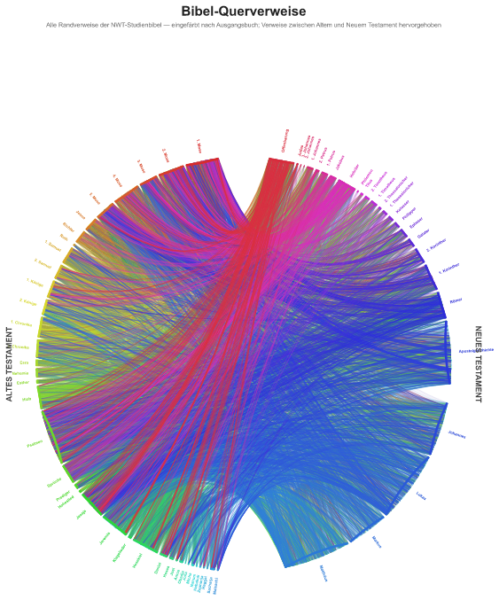

# Bibel-Querverweise — Circular Bible Cross-Reference Graphic

Turns a JW Library **Study Bible** publication (`nwtsty_X.jwpub`) into a circular diagram of all
its cross-references: the 66 Bible books arranged around a ring, every marginal cross-reference
drawn as a chord through the circle, coloured by source book, with **Old↔New Testament links
highlighted**. Inspired by the "All Prophecies about Jesus" arc diagram, bent into a circle.

It is a single self-contained binary (written in Rust) — download a Bible update and rerun it to
regenerate everything. No runtime, no system libraries.

[](LICENSE.txt)
[][code-of-conduct]



*(Above is the committed `docs/bible_circle_sm.png` thumbnail, produced by `--formats png-sm`; the
full `bible_circle.png` is 300 dpi. To refresh it, regenerate and copy the output into `docs/`.)*

## What you get

Running the tool produces these files (next to the input `.jwpub`). Each one corresponds to a
`--formats` name (in parentheses):

| File | Description |
| --- | --- |
| `bible_circle.png` | High-resolution raster image, 300 dpi (`png`) |
| `bible_circle_sm.png` | Small, tightly-cropped thumbnail (≤ 500 KB) for embedding, e.g. in this README (`png-sm`) |
| `bible_circle.svg` | Vector image (print quality; large file) (`svg`) |
| `bible_circle.html` | **Interactive** viewer — zoom, pan, hover a line to see the two verses, toggle "Old↔New only". Self-contained, works offline. (`html`) |
| `bible_crossrefs.csv` | Every cross-reference as readable verse refs (e.g. `Jes 7:14 → Mat 1:23`) (`csv`) |
| `nwtsty_X.db` | The Bible's SQLite database, extracted from the `.jwpub` (`db`) |

## Install

### Download a release binary (recommended)

Grab the right binary for your platform from the [**Releases**][releases] page and put it on your
`PATH`. Assets are named:

```
jw-bible-crossref-graph-{linux|darwin|windows}-{amd64|arm64}{-gnu|-musl}{.exe}
```

For example: `jw-bible-crossref-graph-linux-amd64-musl` (static Linux build),
`jw-bible-crossref-graph-darwin-arm64` (Apple Silicon), or
`jw-bible-crossref-graph-windows-amd64.exe`. GitHub shows each asset's SHA-256 digest next to it.

On Linux/macOS, mark it executable:

```bash
chmod +x jw-bible-crossref-graph-*
```

### Build from source

Needs a [Rust toolchain](https://rustup.rs) (stable):

```bash
cargo install --git https://github.com/Team-MaRo/jw-bible-crossref-graph
# ...or, in a clone:
cargo build --release        # binary at target/release/jw-bible-crossref-graph
```

### Don't want Rust on your host?

This repo ships a [dev container](.devcontainer/devcontainer.json). Open the folder in **VS Code**
and choose **"Reopen in Container"** (Dev Containers extension), or open it in **GitHub
Codespaces** — a Rust image with everything ready. Then `cargo run --release -- nwtsty_X.jwpub`.

## Step 1 — Get the Bible file

The graphic is built from the **New World Translation Study Bible** publication file,
`nwtsty_X.jwpub`. `nwtsty` is its symbol; the `_X` marks the encrypted/packaged variant.

How to obtain it:

1. Go to **<https://www.jw.org/de/bibliothek/bibel/>** (jw.org → Bibliothek → Bibel).
2. Open the **Studienausgabe** (Study Bible) and use the **download / Herunterladen** option,
   choosing the **JWPUB** format. Only the *study* edition contains the cross-references this
   tool needs — the regular reading edition does not.
3. Save the downloaded `nwtsty_X.jwpub` somewhere; the outputs are written next to it.

(Alternatively, the free **JW Library** desktop app stores downloaded publications as `.jwpub`
files in its app-data folder, where the study Bible is likewise named `nwtsty_X.jwpub`.)

> Any future `nwtsty` `.jwpub` update works — and the tool also accepts any other NWT `.jwpub`
> edition that includes cross-references. The regular (non-study) Bible, and the EPUB/PDF/RTF
> downloads, do **not** contain the cross-reference data and will not work.

No password or decryption is required: the `.jwpub` is just a zip-within-a-zip around a plain
SQLite database, which the tool reads directly.

## Step 2 — Run it

```bash
# point it at the file explicitly
jw-bible-crossref-graph nwtsty_X.jwpub

# ...or let it auto-find the first *.jwpub in the current directory
jw-bible-crossref-graph
```

You'll see progress for each stage (extracting the database, loading ~65,600 cross-references,
writing the CSV, rendering the SVG/PNG, building the HTML). When it finishes, open
`bible_circle.png` or, for the interactive version, `bible_circle.html` in a web browser.

### Options

| Flag | Default | Description |
| --- | --- | --- |
| `--lang <de\|en>` | `de` | Language for book names, labels, titles, the HTML UI and the CSV headers. See the note below — this only relabels the graphic. |
| `--formats <list>` | `all` | Comma-separated subset of `db,csv,svg,png,png-sm,html` (or `all`). Produce only what you need. |

```bash
# English labels, only the interactive viewer + README thumbnail
jw-bible-crossref-graph --lang en --formats html,png-sm

# just the small thumbnail (fast — skips the big PNG and SVG)
jw-bible-crossref-graph --formats png-sm
```

> **Note on `--lang`:** the `.jwpub` only supplies verse *numbers*, so the tool applies all book
> names and text itself. `--lang en` therefore relabels everything in English (e.g. `Isa 7:14 → Mt
> 1:23`) regardless of which edition's `.jwpub` you feed in; it does not translate any actual Bible
> text.

## Step 3 — Use the interactive viewer

Open **`bible_circle.html`** in any modern browser:

- **scroll** to zoom, **drag** to pan
- **hover** any coloured line to see the two verses it links
- tick the **"Old↔New only"** checkbox (labelled in your chosen `--lang`) to hide the dense
  background and show only the Old↔New Testament connections

## Customising the look

The geometry/style knobs live in the `cfg` module at the top of [`src/bible.rs`](src/bible.rs) —
gap sizes between books, the Gospel-bracket spacing, chord curvature, line opacity/width, image
size/DPI, and the small-thumbnail byte budget. Language text and book names live in per-language
YAML files in [`i18n/`](i18n) (e.g. [`i18n/de.yaml`](i18n/de.yaml)), embedded into the binary at
build time. To add a language, drop in `i18n/<code>.yaml` and add a matching `Lang` variant in
[`src/strings.rs`](src/strings.rs). Edit and rebuild. See [AGENTS.md](AGENTS.md) for details.

## Notes

- Labels default to **German** (this is the German Studienbibel); pass `--lang en` for English book
  names, titles, UI and CSV headers. Either way the underlying data is whatever `.jwpub` you supply.
- The themes and line styles of the original "All Prophecies about Jesus" infographic were
  hand-curated by its author and are **not** part of the Bible data, so this graphic colours by
  source book instead — the encoding the data actually supports.

## Contributing

Please read [CONTRIBUTING.md][contributing] for details on our code of conduct and the process for submitting pull requests.

This project uses [Conventional Commits](https://www.conventionalcommits.org/) — releases are
automated from the commit history.

## Versioning

We use [SemVer](https://semver.org/). Releases are automated with
[release-please](https://github.com/googleapis/release-please): merging the generated release PR
tags a version (e.g. `1.2.3`, no `v` prefix) and publishes binaries to the
[Releases][releases] page. See the [tags][gh-tags] for available versions.

## Authors

### Special thanks for all the people who had helped this project so far

- **Manuele** - [D3strukt0r](https://github.com/D3strukt0r)

See also the full list of [contributors][gh-contributors] who participated in this project.

### I would like to join this list. How can I help the project?

We're currently looking for contributions for the following:

- [ ] Bug fixes
- [ ] Translations
- [ ] etc...

For more information, please refer to our [CONTRIBUTING.md][contributing] guide.

## License

This project is licensed under the MIT License - see the [LICENSE.txt](LICENSE.txt) file for details.

## Acknowledgments

- Built with [clap](https://github.com/clap-rs/clap), [rusqlite](https://github.com/rusqlite/rusqlite),
  [zip](https://github.com/zip-rs/zip2), and [resvg / usvg / tiny-skia](https://github.com/linebender/resvg)
  for SVG→PNG rendering.
- Ring/title text uses a sans-serif font from your system (Arial, Helvetica, DejaVu Sans, … —
  whichever is installed); no font is bundled. On a host with no fonts the labels are simply
  omitted (the chords and rim arcs still render).

[releases]: https://github.com/Team-MaRo/jw-bible-crossref-graph/releases
[gh-tags]: https://github.com/Team-MaRo/jw-bible-crossref-graph/tags
[gh-contributors]: https://github.com/Team-MaRo/jw-bible-crossref-graph/contributors
[contributing]: https://github.com/Team-MaRo/.github/blob/master/CONTRIBUTING.md
[code-of-conduct]: https://github.com/Team-MaRo/.github/blob/master/CODE_OF_CONDUCT.md
